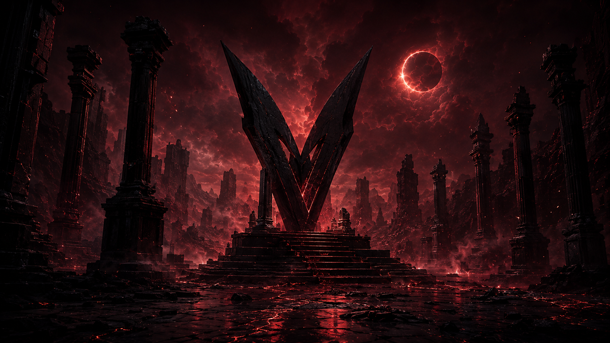
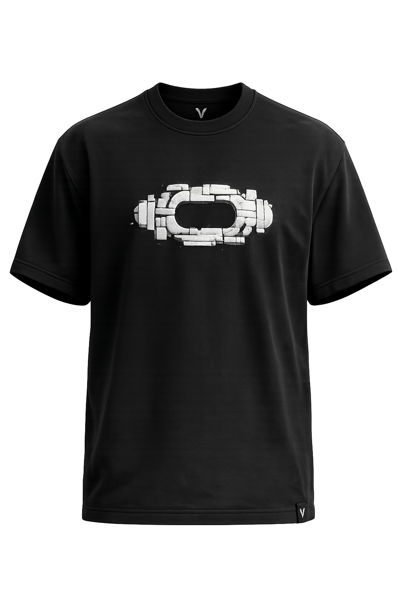
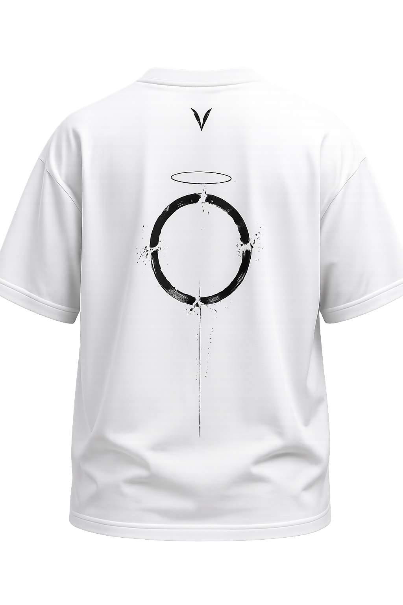
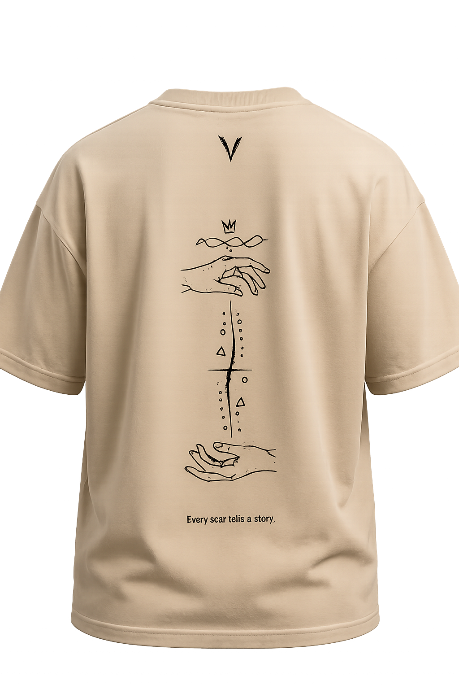
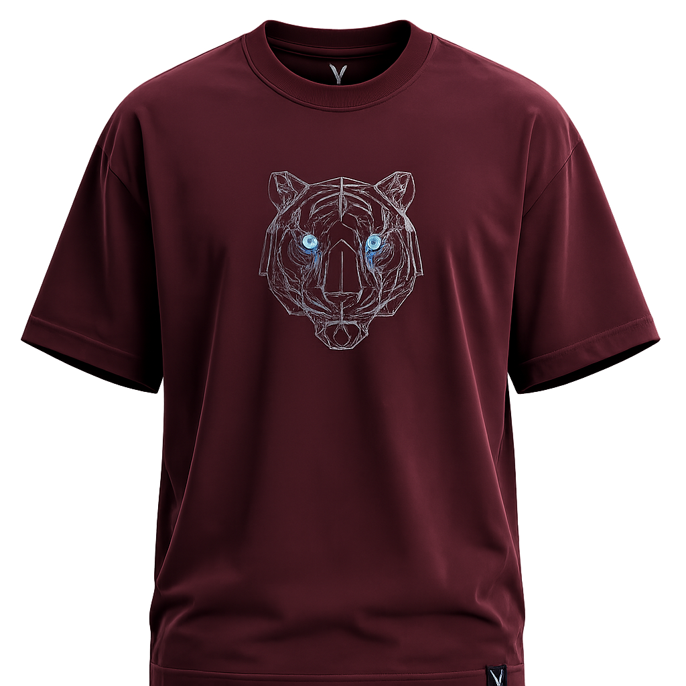

<div align="center">
  
  <br/>
  <h1>LA VENGEANCE - Chapter I: Awakening</h1>
  <p><strong>A Premium Streetwear Digital Storefront</strong></p>
  
  <p>
    
    
    
    
    
  </p>
</div>

---

## 🏴 About The Project

**La Vengeance** is a high-end streetwear e-commerce platform built to deliver a cinematic and immersive shopping experience. Replacing the standard grid-based store with an editorial, story-driven layout, this platform utilizes modern web animations and a striking dark-mode aesthetic to showcase premium apparel.

<div align="center">
  
  
</div>

### ✨ Key Features

- **Cinematic Hero Carousel**: A full-screen, story-driven slider with text-reveal animations, custom typography, and dynamic backgrounds.
- **Editorial Product Display**: Products are displayed with layered depths, glowing accents, and glassmorphism (translucent) UI elements.
- **Micro-Interactions**: Smooth hover states, glowing borders, and staggered load animations using Framer Motion to make the UI feel alive.
- **Fully Responsive**: Meticulously crafted for seamless experiences across desktop, tablet, and mobile devices.
- **App Router Architecture**: Built on Next.js 14+ utilizing Server Components and optimized routing.

---

## 📸 Visuals & Collection

<div align="center">
  
  
  
  
</div>
<br/>

*Chapter I: Awakening features "The Fractured Core", "The Halo of Fracture", "Every Scar Tells A Story", and "The Awakened One".*

---

## 🚀 Getting Started

To run the La Vengeance platform locally on your machine, follow these steps:

### Prerequisites
Make sure you have Node.js (v18+) and npm installed.

### Installation

1. **Clone the repository**
   ```bash
   git clone https://github.com/YOUR_USERNAME/la-vengeance-storefront.git
   cd la-vengeance-storefront
   ```

2. **Install dependencies**
   ```bash
   npm install
   ```

3. **Run the development server**
   ```bash
   npm run dev
   ```

4. **View the platform**
   Open [http://localhost:3000](http://localhost:3000) in your browser.

---

## 🛠 Tech Stack

- **Framework:** Next.js (App Router)
- **Styling:** Tailwind CSS (with custom design tokens and keyframes)
- **Animations:** Framer Motion, CSS Transitions
- **Icons:** Lucide React
- **Language:** TypeScript

---

## 📂 Project Structure

```text
app-v3/
├── public/                 # Static assets (images, logos, SVGs)
│   ├── images/products/    # Product images & backgrounds
│   ├── logo.svg            # Brand Logo
│   └── icon.svg            # Favicon
├── src/
│   ├── app/                # Next.js App Router pages
│   │   ├── product/        # Dynamic product detail pages
│   │   ├── layout.tsx      # Root layout
│   │   └── page.tsx        # Homepage
│   ├── components/         # Reusable UI components
│   │   ├── StorefrontHero  # Cinematic Carousel
│   │   ├── Collection      # Product Grid
│   │   ├── Header / Footer # Navigation
│   │   └── ...
│   ├── data/               # Product JSON/data structures
│   └── globals.css         # Global Tailwind & Custom CSS
└── tailwind.config.ts      # Tailwind theme extensions
```

<div align="center">
  <br/>
  <p><i>"Fragmented, Yet Unbroken."</i></p>
</div>
